<i>Perception becomes geometry.</i>

<h1>MD Shaifullah Sharafat</h1>

<b>Machine Learning Researcher · Computer Vision · Intelligent Sensing</b>

<i>Learning useful representations. Building reliable systems.</i>

<a href="#research-profile">About</a> &nbsp; / &nbsp; <a href="#selected-publications">Papers</a> &nbsp; / &nbsp; <a href="#featured-research-systems">Projects</a> &nbsp; / &nbsp; <a href="#research-toolkit">Toolkit</a>

## Research profile

I am a **Computer Science and Engineering graduate from North South University** and a machine learning researcher based in Bangladesh. I build **data-efficient, interpretable, and deployable AI systems** that connect learning algorithms with images, sensors, and real-world decision making.

My published work spans **self-supervised visual representation learning** and an **edge-deployed IoT–AI system for precision agriculture**. My recent systems work also includes leakage-controlled **3D DaT SPECT classification** for Parkinsonian syndrome screening. I am extending this foundation toward robust computer vision, multimodal scientific sensing, physics- and knowledge-guided learning, robotics perception, and responsible language technologies.

> **Research objective:** turn strong representations into reliable systems that remain useful under limited labels, distribution shift, noisy sensing, and deployment constraints.

## At a glance

 

| | |
|---|---|
| **Core** | Computer vision · self-supervised learning · robust and efficient deep learning |
| **Systems** | Intelligent sensing · edge AI · IoT–ML integration · decision support |
| **Emerging directions** | Multimodal learning · robotics perception · scientific ML · responsible Bangla NLP |
| **Application domains** | Agriculture · medical imaging · environmental sensing · autonomous systems |
| **Research output** | 2 peer-reviewed journal articles · 1 first-author manuscript under review · open research code and data |

## Selected publications

<table>
<tr>
<td width="50%" valign="top">
<h3>🌿 Self-supervised vision for plant health</h3>

<strong>Towards practical AI for agriculture: A self-supervised attention framework for Spinach leaf disease detection</strong>

<em>PLOS ONE, 21(1), e0340989, 2026</em> <strong>Co-author</strong>

<ul><li>SimSiam pretraining with attention-enhanced CNNs</li><li>CNN and vision-transformer benchmarking under limited data</li><li>Calibration, corruption robustness, and gradient-based explainability</li><li>Best domain-optimized model: <strong>97.31% accuracy</strong> and <strong>0.9983 macro ROC–AUC</strong></li></ul>
<a href="https://doi.org/10.1371/journal.pone.0340989"><strong>Paper</strong></a> · <a href="https://github.com/SAIFULLAH-SHARAFAT/A-Self-Supervised-Deep-Learning-Framework-for-Malabar-Spinach-Leaf-Disease-Classification"><strong>Code</strong></a> · <a href="https://huggingface.co/datasets/saifullah03/malabar_spinach_leaf_disease_dataset"><strong>Dataset</strong></a>
</td>
<td width="50%" valign="top">
<h3>🌾 Edge intelligence for precision agriculture</h3>

<strong>An IoT-enabled AI system for real-time crop prediction using soil and weather data in precision agriculture</strong>

<em>Smart Agricultural Technology, 12, 101263, 2025</em> <strong>First author</strong>

<ul><li>End-to-end acquisition, inference, and visualization pipeline</li><li>Soil N–P–K, pH, moisture, and live weather integration</li><li>Classical ensembles and deep tabular architectures</li><li>Raspberry Pi deployment with an interactive IoT dashboard</li></ul>
<a href="https://doi.org/10.1016/j.atech.2025.101263"><strong>Paper</strong></a> · <a href="https://github.com/SAIFULLAH-SHARAFAT/An-IoT-Enabled-AI-System-for-Real-Time-Crop-Prediction-Using-Soil-and-Weather-Data"><strong>Code</strong></a>
</td>
</tr>
</table>

<b>◷ Manuscript under review — transformer-based vision</b>

**Color-Aware and Token-Attentive Swin Transformers for Tea Leaf Disease and Pest Classification**  
*First-author manuscript · under review*

- Studies color-aware feature fusion and token-level attention for fine-grained disease and pest recognition.
- Evaluates transformer-based visual modeling for difficult agricultural image classes.

*This manuscript has not yet been accepted; it is separate from the peer-reviewed publications above.*

## Featured research systems

<table>
<tr>
<td width="55%" valign="top">
<h3>🧠 Multicenter 3D DaT SPECT classification</h3>

<strong>DrivenData DaT Parkinson’s Challenge · 2026</strong>

A reproducible screening pipeline designed around the realities of multicenter neuroimaging rather than random image-level validation.

<ul><li>Leakage-controlled 3D/2.5D modeling and acquisition-group-held-out validation</li><li>Frozen DINOv3 representations, radiomics/PCA features, and multimodal fusion</li><li>21-model volumetric ensemble with probability calibration and domain-shift testing</li><li>Previously recorded internal OOF log loss improved from <strong>0.3076 to 0.2930</strong>; AUROC from <strong>0.9389 to 0.9456</strong></li><li>Deterministic, network-free inference for containerized evaluation</li></ul>

<em>Internal validation results, not official leaderboard scores or evidence of clinical readiness.</em>

<a href="https://github.com/SAIFULLAH-SHARAFAT/DaT-Parkinson-Challenger"><strong>Explore the repository →</strong></a>
</td>
<td width="45%" valign="top">
<h3>🌱 Counterfactual weed vision</h3>

<strong>Background-robust recognition · ongoing</strong>

An ongoing research pipeline that tests whether weed detectors learn the plant or exploit contextual shortcuts.

<ul><li>Segmentation-assisted foreground/background interventions</li><li>Matched counterfactual evaluation arms</li><li>Cluster-held-out split design and annotation audits</li><li>Executable CIP-DETR experimental scaffold</li></ul>
Completed audits and frozen artifacts are distinguished from experiments still in progress.

<a href="https://github.com/SAIFULLAH-SHARAFAT/Weed_detection"><strong>Explore the repository →</strong></a>

</td>
</tr>
</table>

<b>＋ Research and engineering experience</b>

| Period | Role | Focus |
|---|---|---|
| **2025–Present** | **Deep Learning Researcher**, North South University | Self-supervised vision, transformers, robustness, calibration, and explainability |
| **2024–2025** | **Undergraduate Researcher / Capstone Research Lead**, North South University with Habiganj Agricultural University | Plant-health vision and an end-to-end IoT–AI crop decision system |
| **Apr–Jun 2025** | **IoT Engineer**, Neways International Company Limited | Embedded sensing, device integration, and applied IoT development |

## Current research directions

- **Representation learning:** self-supervision, contrastive objectives, attention, and foundation-model adaptation for label-scarce domains.
- **Reliable perception:** corruption robustness, calibration, explainability, uncertainty, and evaluation under distribution shift.
- **Scientific and sensor-aware ML:** multimodal fusion, physics- or knowledge-guided learning, and spatiotemporal decision support.
- **Embodied intelligence:** visual sensing and learning for UAV/UGV and robotic perception pipelines.
- **Responsible language technology:** evaluation of social-bias drift across Bangla, Romanized Bangla, and Banglish.

## Research toolkit

| Area | Experience |
|---|---|
| **Vision and ML** | PyTorch, TensorFlow, OpenCV, scikit-learn, CNNs, vision transformers, SimSiam, supervised contrastive learning |
| **Evaluation** | Ablation studies, calibration, corruption testing, Grad-CAM family, classification and regression metrics |
| **Data and modeling** | NumPy, pandas, SQL, tree ensembles, tabular deep learning, multimodal fusion, experiment design |
| **Embedded and IoT** | Raspberry Pi, ESP32, Arduino, FreeRTOS, sensors/actuators, UART/I²C/SPI, edge inference |
| **Research workflow** | Git/GitHub, Linux, Bash, Jupyter, FastAPI, MATLAB, LaTeX, reproducible pipelines and scientific writing |

## Education and continuous learning

**BSc in Computer Science and Engineering**  
North South University, Dhaka, Bangladesh · 2025

Recent focused study includes deep learning, mathematical foundations for ML, computer vision, Python/SQL, and IoT/embedded systems. Credentials are selected below for relevance; credential IDs are omitted from this public profile.

<b>Selected credentials</b>

 

**Deep learning and machine learning**

- Neural Networks and Deep Learning — DeepLearning.AI, 2026
- Improving Deep Neural Networks: Hyperparameter Tuning, Regularization and Optimization — DeepLearning.AI, 2026
- Structuring Machine Learning Projects — DeepLearning.AI, 2026
- Convolutional Neural Networks — DeepLearning.AI, 2026
- Mathematics for Machine Learning and Data Science — DeepLearning.AI, 2025
- Supervised Machine Learning: Regression and Classification — Stanford Online, 2024

**Programming and data**

- Python for Everybody — University of Michigan, 2026
- SQL for Data Science — University of California, Davis, 2026
- Python for Data Science, AI & Development — IBM, 2024
- HackerRank Python Certificate — HackerRank, 2025

**IoT and embedded systems**

- The Raspberry Pi Platform and Python Programming for the Raspberry Pi — University of California, Irvine, 2025
- The Arduino Platform and C Programming — University of California, Irvine, 2025
- Interfacing with the Arduino — University of California, Irvine, 2025
- Introduction to the Internet of Things and Embedded Systems — University of California, Irvine, 2025
- Getting Started with Azure IoT Hub — Coursera Project Network, 2024

**Research and communication**

- IEEE Authorship and Open Access Symposium — IEEE, 2025
- Academic English: Writing — University of California, Irvine, 2025
- Speak English Professionally — Georgia Institute of Technology, 2025

## GitHub activity

  

<i>Contribution history is shown through the currently working streak service; unreliable public stats endpoints have been removed.</i>

## Let’s connect

I welcome conversations around **computer vision, reliable and efficient AI, intelligent sensing, robotics perception, and interdisciplinary research collaborations**.

[**Google Scholar**](https://scholar.google.com/citations?user=Y1GviSYAAAAJ) · [**ORCID**](https://orcid.org/0009-0005-7757-6950) · [**LinkedIn**](https://www.linkedin.com/in/shaifullah-sharafat/) · [**Email**](mailto:shaifullah.sharafat@northsouth.edu) · [**GitHub**](https://github.com/SAIFULLAH-SHARAFAT)

